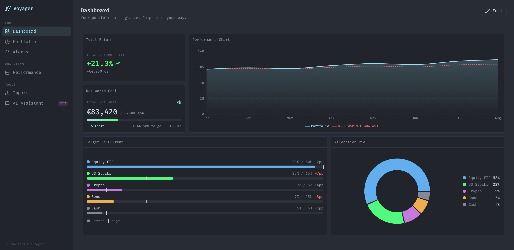

# Voyager

> To the moon and beyond. AI-powered portfolio intelligence.

Voyager tracks investment portfolios, visualizes allocations, benchmarks against references
(e.g. MSCI World), surfaces rebalancing alerts, and adds a conversational AI layer.



*The composable dashboard: total return + net-worth goal KPIs, a portfolio-vs-MSCI World
performance chart, current-vs-target allocation drift, and an allocation breakdown — all
drag/resize widgets from the registry. (Mock data shown.)*

## Stack

Next.js 15 (App Router) · TypeScript (strict) · Tailwind CSS v4 · Recharts · react-grid-layout ·
Zod · Supabase (Postgres + Auth + RLS) · Drizzle · Anthropic Claude · Resend · Vercel.

## Getting started

```bash
npm install
cp .env.example .env.local   # fill in Supabase / Anthropic / Resend keys
npm run dev                  # http://localhost:3000  (redirects to /dashboard)
```

## Scripts

| Script | Purpose |
|---|---|
| `npm run dev` | Start the dev server |
| `npm run build` | Production build |
| `npm run lint` | ESLint (`next lint`) |
| `npm run typecheck` | `tsc --noEmit` |
| `npm run test` | Vitest unit tests |

## What's in this skeleton

- **App shell** — sidebar driven entirely by `components/shared/nav-config.ts` (navigation as data).
  Dark, monospace, One-Dark-inspired theme (see `app/globals.css`).
- **Dashboard widget system** — `components/widgets/registry.ts` is the single source of truth.
  Drag/resize grid (`react-grid-layout`), edit/view modes, widget picker. Layout persists to
  `localStorage` as a stand-in until the Supabase tables are wired. Five widgets ship today:
  Total Return, **Net Worth Goal**, Performance Chart (**Portfolio vs MSCI World**),
  **Target vs Current** allocation drift, and Allocation Pie.
- **Trade Republic CSV import** — `lib/import/trade-republic/` (pure, unit-tested):
  semicolon CSV parser, **PII hard-strip via column allowlist**, Zod validation, TR→Voyager type
  mapping, idempotent orchestration. Upload UI at `/import`, API at
  `app/api/import/trade-republic/route.ts`.
- **Finance math** — `lib/finance/drift.ts` (pure functions, exhaustively testable).
- **Database** — `supabase/migrations/0001_init.sql` defines the transaction-ledger schema with
  **RLS on every user-scoped table** and the `(user_id, broker, external_id)` dedup constraint.

### Importing your Trade Republic history

A sample export lives at `tests/fixtures/trade-republic-sample.csv` (used by the unit tests).
Once Supabase auth + persistence are wired (see the `TODO(phase-1)` in the import route), upload
your own export at `/import` — it is processed entirely server-side and PII is stripped before
anything is stored.

### Regenerating the dashboard screenshot

`docs/dashboard.png` is captured with Playwright (Chromium). With the app running:

```bash
npm run build && npx next start -p 3100 &   # or: npm run dev (port 3000)
URL=http://localhost:3100/dashboard npm run screenshot
```

## Not yet wired (intentional skeleton gaps)

- Supabase auth + Drizzle persistence in the import route (parsing/PII-strip is real today).
- ISIN→ticker resolution (OpenFIGI), price fetching, and the AI assistant endpoint.

These are called out with `TODO(phase-1)` markers in the code.
