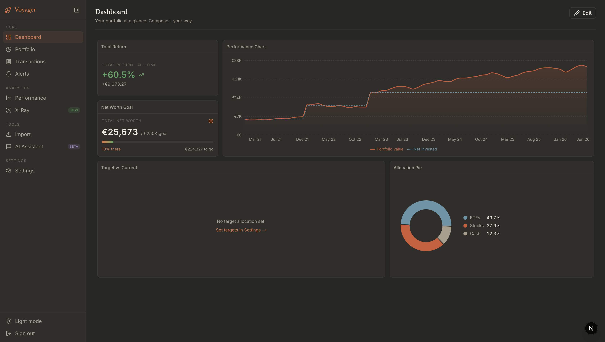
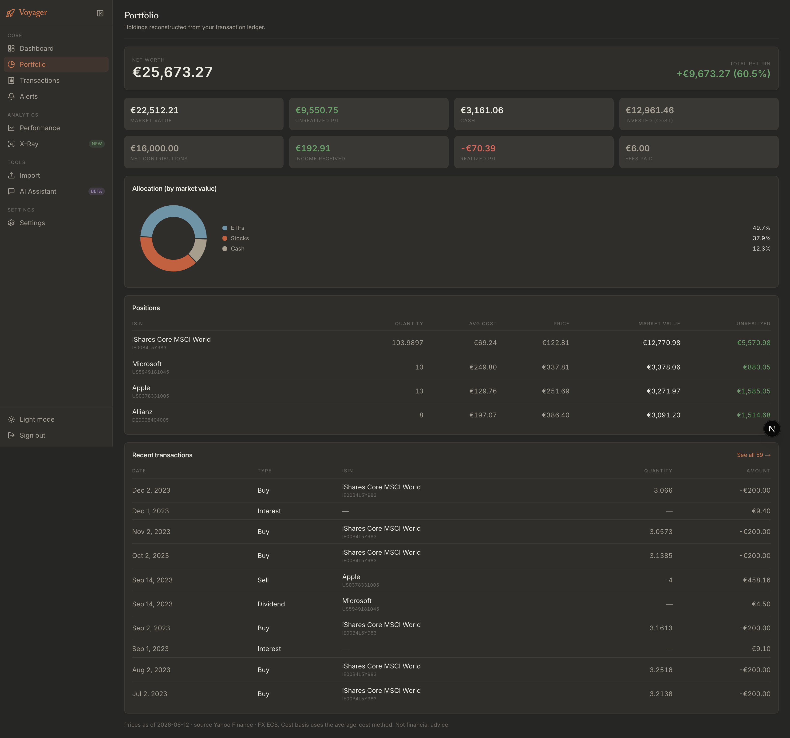
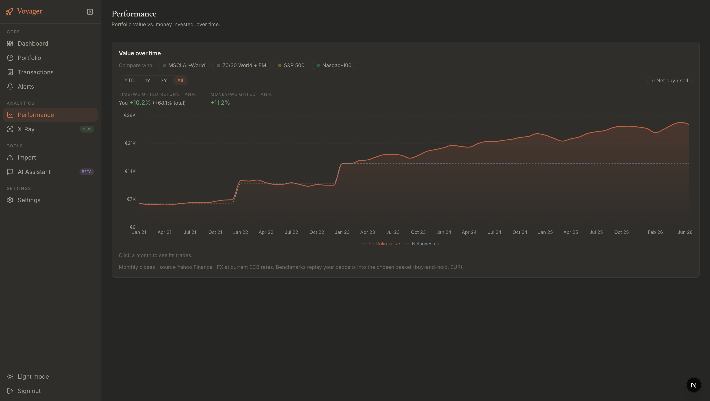
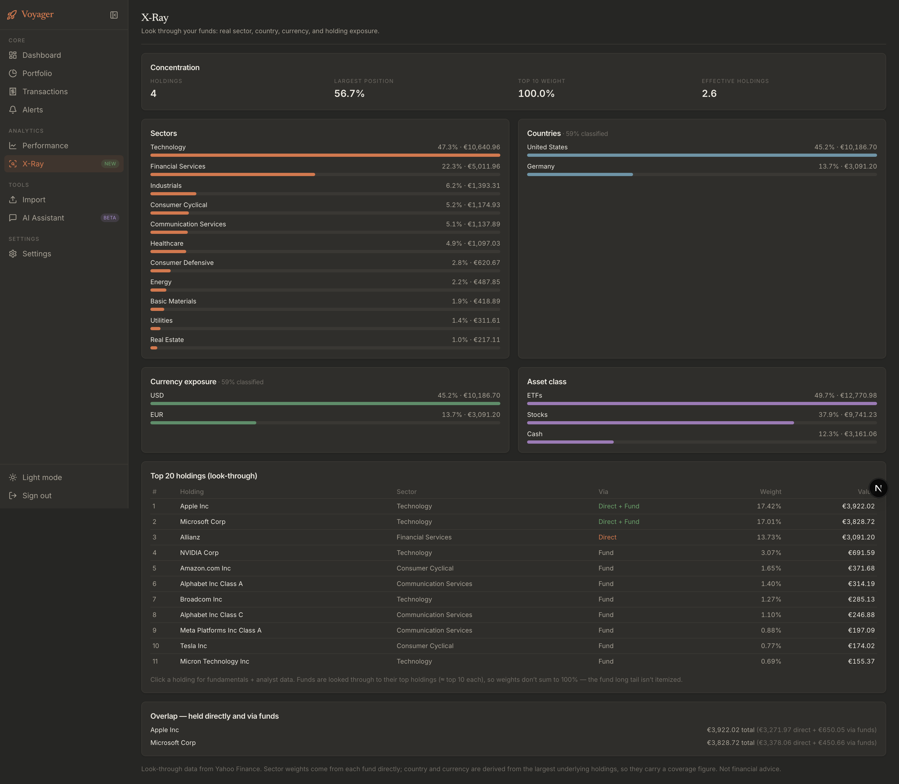
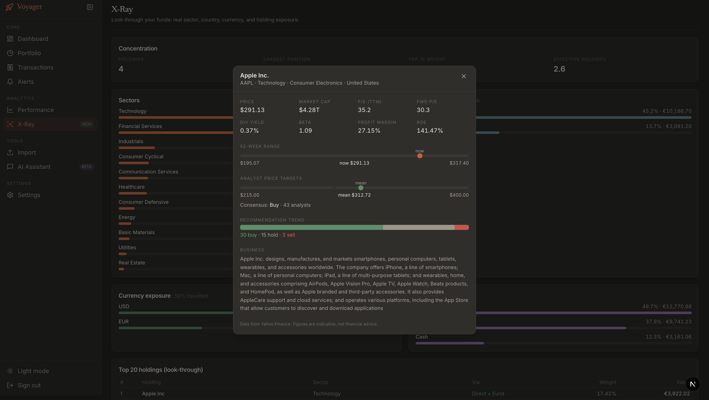

# Voyager

> To the moon and beyond. AI-powered portfolio intelligence.

Voyager is a private, self-hostable portfolio tracker. Import a broker CSV and it reconstructs
your holdings from the transaction ledger, prices them in EUR, charts performance against
real benchmarks, looks through your funds to the underlying companies, and pulls per-instrument
fundamentals and analyst data. Built to run for free on Vercel + Supabase.



*The composable dashboard: all-time return and net-worth-goal KPIs, a portfolio-vs-MSCI World
performance chart, current-vs-target allocation drift, and an allocation breakdown — drag/resize
widgets from the registry. All screenshots in this README use a synthetic 3-year sample portfolio.*

## Features

Some examples:

<details>
<summary><b>Portfolio overview</b> — holdings, cost basis, allocation, and ledger, reconstructed from transactions</summary>

<br>

Net worth, market value, unrealized/realized P/L, net contributions, and income — all derived
from the transaction ledger (no stored snapshots). Allocation pie by market value, per-position
cost basis vs. live price, and the recent-transactions ledger.



</details>

<details>
<summary><b>Performance</b> — TWR / MWR, benchmark overlays, and buy/sell markers over time</summary>

<br>

Value vs. net invested over a selectable window (YTD / 1Y / 3Y / All). Time-weighted and
money-weighted returns recompute per window. Overlay your own contributions replayed into
MSCI All-World, 70/30 World+EM, S&P 500, or Nasdaq-100. Net buy/sell month markers, click a
month to drill into that month's trades.



</details>

<details>
<summary><b>X-Ray</b> — fund look-through into sectors, countries, currency, and real holdings</summary>

<br>

Looks through ETFs via Yahoo `quoteSummary` into true sector allocation, top-20 look-through
holdings (each tagged with its company sector), country and currency exposure, direct-vs-fund
overlap, and concentration stats.



</details>

<details>
<summary><b>Holding detail</b> — fundamentals and analyst data per instrument</summary>

<br>

Click a holding in the X-Ray top-20 for P/E, market cap, beta, dividend yield, margins, ROE,
52-week range, analyst price targets (low/mean/high), buy/hold/sell consensus, and a business
summary. Verified on both US and EU listings.



</details>

<details>
<summary><b>Trade Republic CSV import</b> — PII-stripped, idempotent, server-side only</summary>

<br>

Semicolon CSV parser with a hard column allowlist (counterparty name/IBAN/payment reference are
stripped before anything is stored), Zod validation, TR→Voyager type mapping, and content-derived
deduplication so re-importing a cumulative export is a no-op. Upload at `/import`; processed
entirely server-side, never logged beyond counts.

</details>

## Stack

Next.js 15 (App Router) · TypeScript (strict) · Tailwind CSS v4 · shadcn/ui · Recharts ·
react-grid-layout · TanStack Query · Zod · Supabase (Postgres + Auth + RLS) · Drizzle ·
Anthropic Claude · Resend · Vercel.

## Getting started

```bash
npm install
cp .env.example .env.local   # fill in Supabase + OpenFIGI / Anthropic keys
npm run dev                  # cloud Supabase → http://localhost:3000 (redirects to /dashboard)
```

Then run `supabase/migrations/0001_init.sql` and `0002_isin_name.sql` in your Supabase SQL
editor, sign up at `/signup`, and import a CSV at `/import`.

## Scripts

| Script | Purpose |
|---|---|
| `npm run dev` / `dev:cloud` | Dev server against hosted Supabase (`.env.local`) |
| `npm run dev:local` | Dev server against a local Supabase stack in Docker (`.env.docker`) |
| `npm run build` | Production build |
| `npm run build:local` | Production build against the local stack |
| `npm run lint` | ESLint (`next lint`) |
| `npm run typecheck` | `tsc --noEmit` |
| `npm run test` | Vitest unit tests |

### Cloud or local database

Run against hosted Supabase (`npm run dev`) or a fully local Supabase stack in Docker
(`npm run dev:local`) — switching is just an env file, no code changes. "Local" means the
local **Supabase** stack (Postgres + Auth), not a bare Postgres, because auth and the
`auth.users` foreign keys come from Supabase.

**One-time local setup:**

```bash
# 1. Install Docker Desktop (and start it), then the Supabase CLI:
brew install supabase/tap/supabase        # macOS; see supabase.com/docs for other OSes

# 2. From the repo root, boot the local stack and apply migrations:
supabase init                              # once — creates supabase/config.toml
supabase start                            # boots Postgres + Auth in Docker; prints URLs + keys
supabase db reset                         # applies supabase/migrations/* into the local DB

# 3. Point the app at it:
cp .env.docker.example .env.docker         # then paste the values supabase start printed
```

Map the `supabase start` output into `.env.docker`: **API URL** → `NEXT_PUBLIC_SUPABASE_URL`,
**anon key** / **service_role key** → the two key vars, **DB URL** → `DATABASE_URL`. (The S3
storage values aren't used.) Shared keys like `OPENFIGI_API_KEY` stay in `.env.local` and are
merged in automatically.

```bash
npm run dev:local            # http://localhost:3000, against the local stack
```

Sign up at `/signup`; confirmation emails are caught locally by Inbucket at
<http://localhost:54324>, and you can browse tables in Supabase Studio at <http://localhost:54323>.
Local and cloud are separate databases (separate accounts, no sync). `supabase stop` shuts the
stack down. More detail in [`docs/local-database.md`](./docs/local-database.md).

### Importing your Trade Republic history

Upload your export at `/import` — it is processed entirely server-side, PII is stripped before
anything is stored, and re-importing the same file is idempotent. A realistic 3-year sample
(monthly MSCI World savings plan + individual stocks, dividends, a sell) lives at
`tests/fixtures/trade-republic-3y-portfolio.csv`; regenerate or tweak it with
`node scripts/gen-sample-csv.mjs`.

### Regenerating the README screenshots

`docs/screens/*.png` are captured from the synthetic sample portfolio with Playwright. The
script creates a confirmed demo user (service-role admin API), logs in, imports the fixture
CSV, then screenshots each page. With the app running:

```bash
npm run dev                                       # http://localhost:3000
URL=http://localhost:3000 node scripts/capture-screenshots.mjs
```

It writes `dashboard`, `portfolio`, `performance`, `xray`, and `holding-detail` PNGs into
`docs/screens/`. Override the demo account with `DEMO_EMAIL` / `DEMO_PASSWORD`.

## Wired today

- **Auth + persistence** — Supabase email/password, RLS on every table, Drizzle; import persists to the DB.
- **Live market value** — Yahoo Finance prices (keyless, covers EU-listed XETRA/Euronext holdings) + ECB FX, ISIN→symbol via curated map → OpenFIGI auto-resolution. Local-first: Yahoo 429s from Vercel/datacenter IPs.
- **Real Portfolio, Transactions, Dashboard, Performance, X-Ray, and Settings pages** — no mock data.
- **Performance analytics** — value vs. net invested from Yahoo monthly history, TWR/MWR per window, and contribution-replay benchmark overlays (MSCI All-World, 70/30, S&P 500, Nasdaq-100).
- **X-Ray look-through + holding fundamentals** — sector/country/currency exposure, top holdings, overlap; per-instrument key stats and analyst targets via Yahoo `quoteSummary`.

## Not yet wired

- AI assistant endpoint (Claude, streaming, tool-based) — the data layer that would feed it is in place.
- Rebalancing drift alerts and monthly digest email (Resend).
- Manual transaction add/edit/delete (the ledger is read-only today).
- Layout/config persistence to Supabase (dashboard layout still in `localStorage`).
- Additional broker imports (Scalable, ING, DKB).
